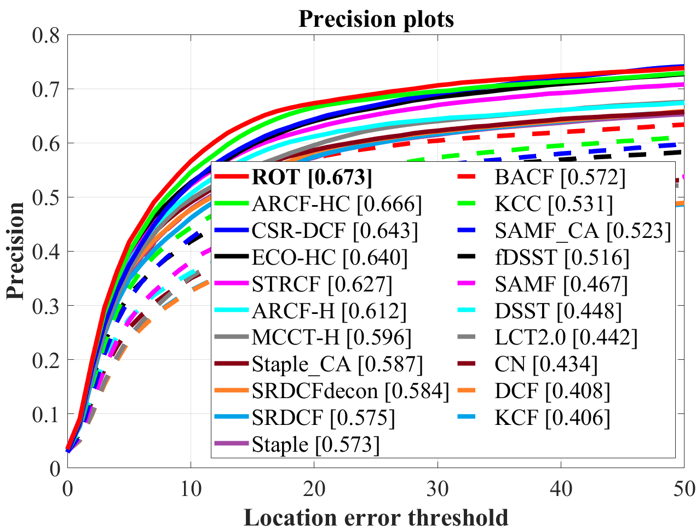
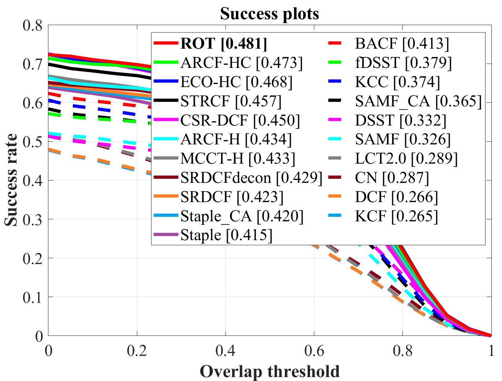
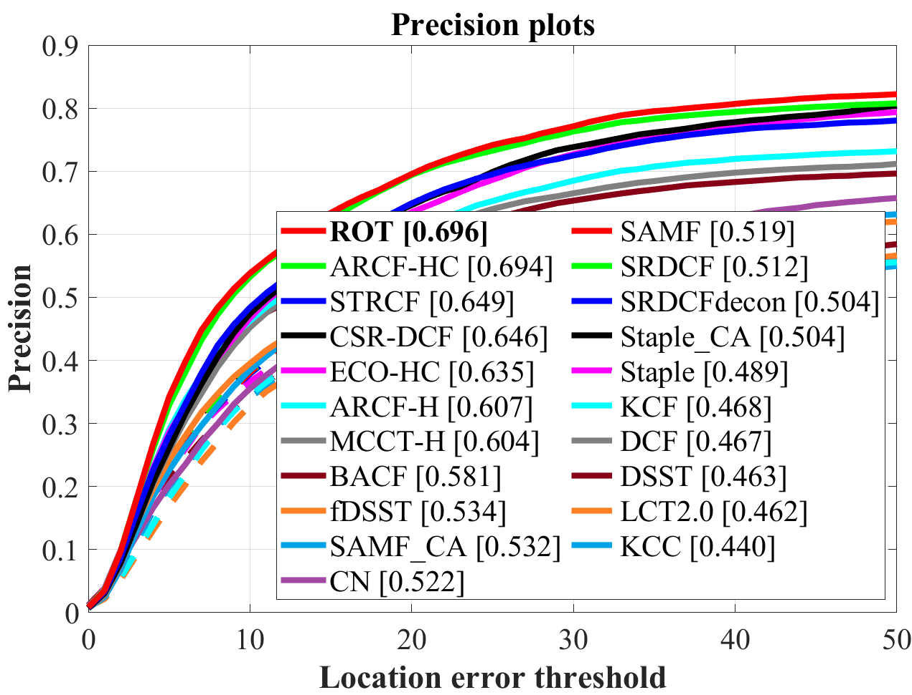
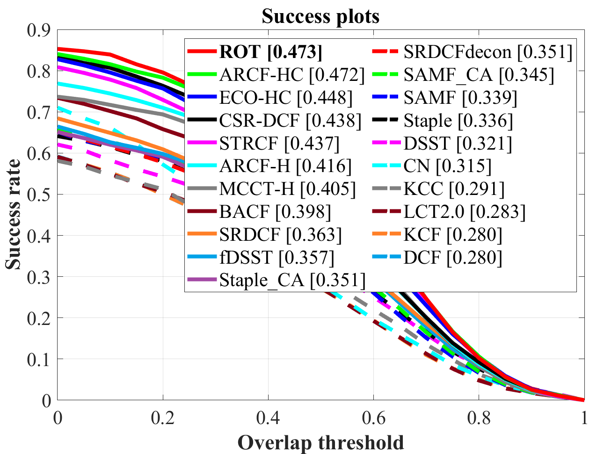
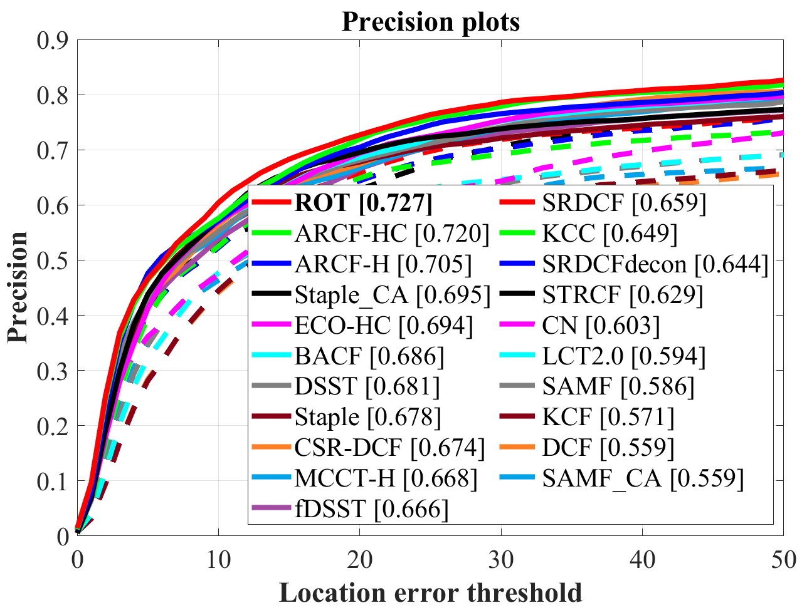
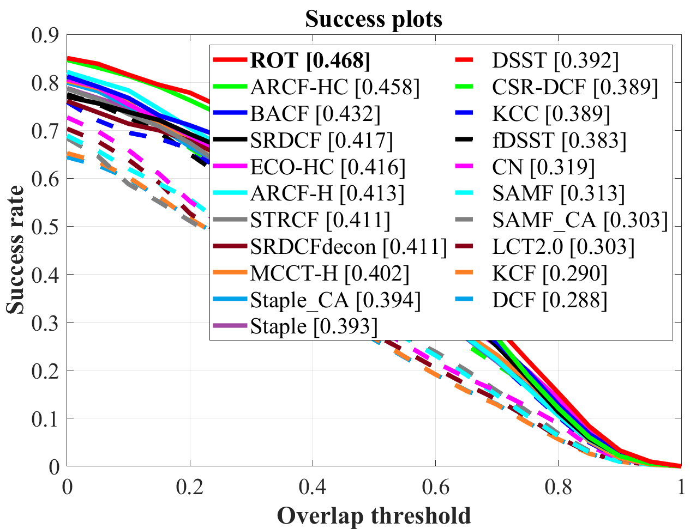

# Region-Oriented UAV Tracking via Inter-Feature Response Mining

Matlab implementation of our region-oriented tracker (**ROT**). 

| **Test passed**                                              |
| ------------------------------------------------------------ |
|  |

## Quantitative results

   
    
<b>Overall performance on UAV123@10fps</b>
 
    
 
        
         
    

   
    
<b>Overall performance on DTB70</b>
 
    
 
        
         
    

   
    
<b>Overall performance on UAVDT</b>
 
    
 
        
         
    

## Getting started

Run `demo_ROT.m` script to test the tracker.

## Acknowledgements

The feature extraction modules and some of the parameters are borrowed from the ECO tracker (https://github.com/martin-danelljan/ECO).
